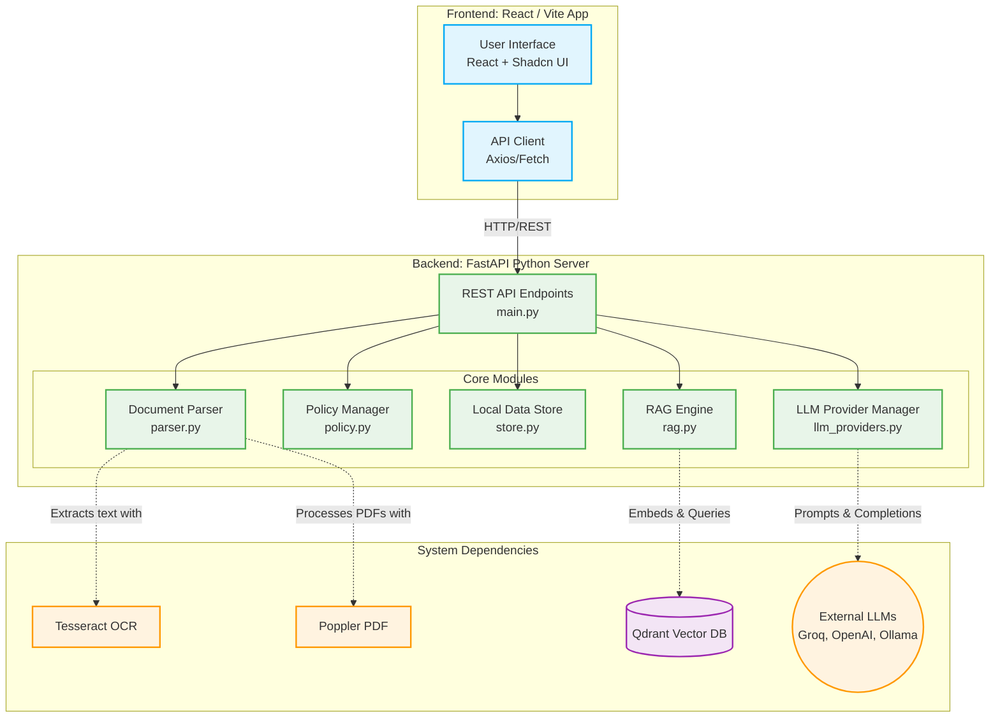

# Detailed System Architecture & Process Flow

This document provides an in-depth look at the architecture of the Contract Analysis System, detailing every major feature and its underlying process flow.

## 1. High-Level Architecture

---

## 2. Feature Workflows & Basic Processes

### A. Document Upload & Parsing (`/upload`, `/upload/batch`)
**Purpose**: Ingest raw contracts, extract text, and prepare them for analysis.
**Process**:
1. User uploads a file (PDF, TXT, etc.) via the frontend.
2. The **Document Parser** receives the file. If it's a PDF or image, it uses **Poppler** and **Tesseract OCR** to extract the raw text.
3. The raw text is passed to a splitting function that breaks the document down into distinct legal **clauses**.
4. Basic metadata is extracted for each clause.
5. The clauses are saved to the **Local Store** with a status of `"uploaded"`.
6. (Optional) Clauses are embedded and upserted into the **Qdrant Vector DB** for Retrieval-Augmented Generation (RAG).

### B. Clause Analysis & Policy Evaluation (`/analyze`)
**Purpose**: Evaluate the contract against business and legal rules.
**Process**:
1. Frontend sends a request to analyze a specific document (`analysis_id`).
2. The backend retrieves the document's clauses from the Local Store.
3. A **Policy** is selected (either user-defined or a comprehensive default covering Financial, Legal, Operational, Privacy, Security, and IP domains).
4. For each clause, the **LLM Agent** is invoked to classify the text and determine risk levels (High, Medium, Low). If RAG is enabled, it queries Qdrant to provide similar clauses as context to the LLM.
5. The **Policy Engine** evaluates the LLM's classification against the active policy rules to determine compliance.
6. The enriched clauses and policy summary are saved back to the Local Store (`status: "analyzed"`) and returned to the frontend.

### C. AI Recommendations (`/recommend`)
**Purpose**: Provide alternative, safer wording for risky clauses.
**Process**:
1. User clicks on a High-Risk clause in the UI and requests a recommendation.
2. Backend sends the clause text, its risk level, and the reasons for the risk to the **LLM Agent**.
3. The LLM generates alternative legal wording that mitigates the identified risks.
4. The recommendation is returned to the user in real-time.

### D. Executive Summary Generation (`/summary/{id}`)
**Purpose**: Generate a high-level overview of the entire contract.
**Process**:
1. User requests a summary for an analyzed contract.
2. The backend retrieves all clauses for the contract and concatenates them.
3. The **LLM Agent** is prompted to read the entire contract context and generate an AI-powered executive summary.
4. The summary is stored with the analysis record and returned to the UI.

### E. AI Chat Assistant (`/chat`)
**Purpose**: Allow users to ask conversational questions about the contract.
**Process**:
1. User types a question in the chat interface.
2. The backend retrieves the contract clauses and overall risk statistics.
3. A prompt is constructed containing the user's question, contract metadata, and a chunk of the contract text as context.
4. The **LLM Agent** processes the prompt and returns a tailored answer based strictly on the contract's contents.

### F. Contract Comparison (`/compare`)
**Purpose**: Compare two different contracts side-by-side to determine which is safer.
**Process**:
1. User selects two analyzed contracts in the frontend.
2. The backend retrieves both analyses from the Local Store.
3. It aggregates the risk statistics (Total Clauses, High/Medium/Low Risk counts) for both documents.
4. It calculates the delta (clause difference, risk difference) and algorithmically determines the "safer" contract based on the lower high-risk count.

### G. Policy Management (`/policy`)
**Purpose**: Customize the rules by which contracts are evaluated.
**Process**:
1. User defines custom domains, micro-policies, and risk weights in the UI.
2. The payload is sent to the **Policy Engine**.
3. The policy is saved to disk/store and can be referenced by ID during future Analysis requests.

### H. LLM Provider Configuration (`/settings`)
**Purpose**: Allow the system to dynamically switch between different AI brains.
**Process**:
1. User configures API keys or local URLs for Groq, OpenAI, or Ollama.
2. The **LLM Provider Manager** saves these settings.
3. Future requests to the LLM Agent will dynamically route to the selected, active provider.
